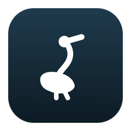
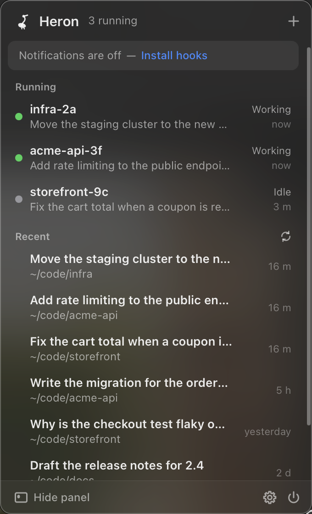
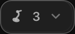

<p align="center">
  
</p>

<h1 align="center">Heron — Claude Code session manager for your menu bar</h1>

<p align="center">
  A quiet menu bar app that watches your <b>Claude Code</b> sessions.<br>
  See how many are running, which one needs you, and start or resume one in a click.<br>
  <b>Local only. No network code, no telemetry, no account.</b>
</p>

<p align="center">
  <b>macOS · Windows · Linux</b> &nbsp;·&nbsp;
  Tauri v2 + Rust + Svelte 5 &nbsp;·&nbsp;
  ~4 MB &nbsp;·&nbsp;
  <a href="LICENSE">MIT</a>
</p>

<p align="center">
  <b>No network code. None.</b> Not for telemetry, not for updates, not for anything.
</p>

<p align="center">
  
</p>

---

Heron is an open-source **Claude Code CLI manager**: a macOS menu bar app (and a
Windows and Linux system tray app) that monitors every `claude` session running on
your machine, shows which one is working, idle or waiting for permission, and sends
a native notification the moment Claude needs you. It is a Claude Code session
monitor, launcher and notifier in about 4 MB, and it never talks to the network.

## Why

Run more than one Claude Code session and the terminal stops telling you what you
need to know. Which one is still working? Which one has been sitting on a
permission prompt for ten minutes while you read something else? Which folder was
that session in?

Heron answers that from the menu bar, without you going looking.

## What it does

- **A count in the menu bar.** The heron glyph carries the number of live sessions, and grows a dot when one is waiting on you.
- **A list, one click away.** Running sessions with live status, project folder, git branch, and the first prompt as the title. Past sessions underneath, ready to resume.
- **Start a session anywhere.** `⌘N`, pick a folder, and your terminal opens there with `claude` running.
- **Resume or focus.** One click resumes a past session, or raises the terminal tab of a running one.
- **The vigil.** A small floating panel pinned to the edge of whichever screen you are on. It never steals focus and you can drag it anywhere.
- **Notifications that mean something.** When Claude asks for permission or finishes a turn, you get a native banner. Click it to jump straight to that terminal.

<p align="center">
  
</p>

## Privacy

Heron reads the files the Claude Code CLI already writes under `~/.claude`, and
writes only to its own app-data folder. That is the whole story.

- **No network code exists in this repository.** The webview's content security policy allows nothing but the app's own files. Check it yourself: `grep -rnE "reqwest|hyper|std::net|TcpStream" src-tauri/src`
- **It never reads `~/.claude/sessions/*.key`**, the CLI's private tokens, or its messaging socket.
- **It never stores your prompts.** The only prompt-derived text kept anywhere is a session title: the first prompt, truncated to 80 characters. Hook payload fields `tool_input` and `user_input` are discarded at parse time.
- **Transcripts are read 64 KB at a time**, never in full.
- **Hooks are opt-in.** Notifications need six hook entries in `~/.claude/settings.json`. Heron adds them only when you click Install, takes a timestamped backup first, and removes exactly what it added on uninstall. The script it installs is 19 lines of `sh` you can read.

Full detail in [docs/PRIVACY.md](docs/PRIVACY.md).

## Install

Grab the installer for your OS from [Releases](https://github.com/musaJawad004/heron/releases), or build it:

```bash
git clone https://github.com/musaJawad004/heron.git
cd heron
npm install
npm run tauri build     # → src-tauri/target/release/bundle/
```

You need Node 20+, Rust stable, and the [Tauri prerequisites](https://v2.tauri.app/start/prerequisites/) for your platform.

Builds are **unsigned**. No Apple developer account, no notarization, nothing uploaded. On macOS a downloaded copy needs one right-click → Open the first time; a copy you built yourself opens normally.

Then click the heron in the menu bar → Settings → Hooks → **Install hooks** to turn on notifications. That is the only step that touches `~/.claude/settings.json`.

## How it works

Claude Code writes a small JSON file per running session into `~/.claude/sessions/`,
carrying its working directory and whether it is busy, idle or waiting. Heron polls
that directory once a second and checks each process is genuinely alive, which is
the live list. Titles come from the first prompt in each transcript.

Notifications come from Claude Code's hooks. The installed script does one thing:
it copies the event JSON into Heron's own folder. Heron watches that folder,
reads each file and deletes it.

```
src-tauri/src/
  model.rs       shared types, mirrored in src/lib/types.ts
  state.rs       the hub: polls the registry, watches hooks, publishes a snapshot
  claude/        reads the CLI's registry, transcripts and history
  hooks/         installs the receiver, watches the spool, posts notifications
  launch/        finds claude, opens terminals, focuses a session
  tray.rs        the menu bar icon and count
  windows.rs     popover, panel and settings placement
  placement.rs   pure geometry, unit-tested
src/
  routes/{popover,panel,settings}    one route per window
  lib/api.ts     the only file that talks to Tauri
```

Two notes for anyone touching window placement, because both cost real debugging:

- macOS lays the desktop out in points but reports each monitor's origin in that
  monitor's own pixels. On a mixed-DPI desk the physical rectangles **overlap**, so
  placing by them puts windows on the wrong screen. Everything here is normalised
  to points first.
- The tray hands you the icon's rectangle in the pixels of whichever screen's menu
  bar was clicked, and position alone cannot tell those screens apart. The icon's
  *height* can, because it matches that screen's menu bar height.

More in [docs/ARCHITECTURE.md](docs/ARCHITECTURE.md) and [docs/HOOKS.md](docs/HOOKS.md).

## Develop

```bash
npm run tauri dev                       # hot reload, tray appears
cd src-tauri && cargo test && cargo clippy -- -D warnings
npm run check                           # svelte-check
```

Open `http://localhost:1420/popover` in a browser and the UI runs on mock data,
so you can work on it without the app.

If you use Claude Code on this repo, it ships a full `.claude/` setup: rules,
hooks that format on edit and refuse to end a turn on a broken build, four
agents, a review workflow, and imported Rust, Tauri and Svelte skills. See
[CLAUDE.md](CLAUDE.md).

## Questions people ask

**Does it work with Claude Code on Windows?** Yes. Heron reads
`%USERPROFILE%\.claude` and registers its hooks through PowerShell. The tray icon
carries the session count there too.

**Does it send my prompts anywhere?** No. There is no network code in the
repository at all, and the only prompt-derived text it stores is a session title
truncated to 80 characters. See [Privacy](#privacy).

**Does it need an API key or a Claude account?** No. Heron never talks to
Anthropic. It reads the files the Claude Code CLI already writes on your disk.

**Will it slow Claude Code down?** No. The hook it installs writes one small file
and exits; it is registered as asynchronous with a five second timeout, and it can
never block or alter a session.

**How do I get notified when Claude asks for permission?** Settings → Hooks →
Install hooks. That adds six entries to `~/.claude/settings.json`, after taking a
backup, and Uninstall removes exactly those.

**Can I use it with several sessions at once?** That is the point. The menu bar
count and the floating panel are both built for running many sessions in parallel.

## Contributing

See [CONTRIBUTING.md](CONTRIBUTING.md). The bar for a change is "does this make
watching Claude Code sessions simpler or safer". Two rules are absolute: no
network code, and nothing that reads `~/.claude/sessions/*.key`.

## License

[MIT](LICENSE). Imported Claude Code skills keep their own notices in
`.claude/skills/THIRD-PARTY-LICENSES.md`.
